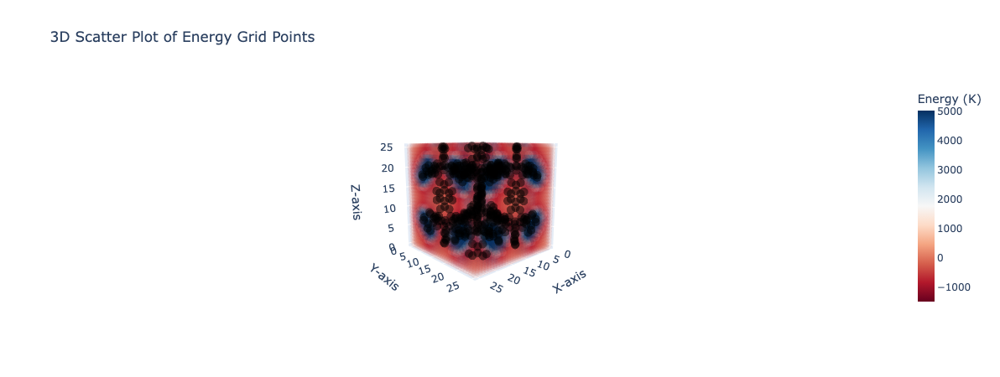

<div align="center">

<h1> Fast Grid 🏁 </h1>


</div>

Arguments:

```bash
python calculate_grids.py --help
```

Run with the default parameters:

```bash
python calculate_grids.py --structure=examples/irmof-1.cif
```

Run with parameters:

```bash
python calculate_grids.py \
--structure=examples/irmof-1.cif \
--ff_type=UFF \
--potential=LJ \
--cutoff=12.8 \
--gas_epsilon=148.0 \
--gas_sigma=3.73 \
--visualize=True
```


