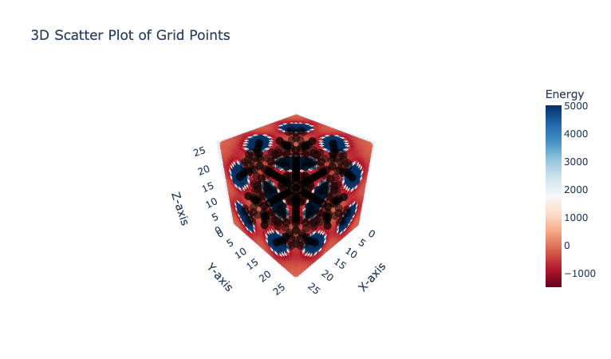
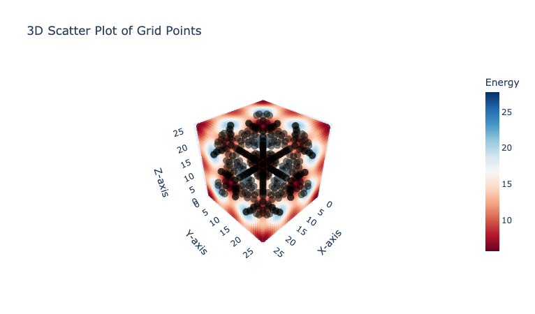

<div align="center">

<h1> Fast Grid 🏁 </h1>

  <p>
    <strong>High-speed Voxel Grid Calculations with Cython</strong>
  </p>

</div>

## Features

### Supported potentials
- LJ Potential (Lennard-Jones)
- Gaussian Potential

### Gas Probe Model
- TraPPE (Methane) [Default]

## Installation

To install Fast Grid, run the following command in your terminal:

```bash
pip install fast-grid
```

## Quick Start
- Help Command

```bash
fast-grid --help
```

- Run an example to generaate enegy grid with the LJ potential

```bash
fast-grid --structure=examples/irmof-1.cif --visualize=True
```

Check out a [tutorial](tutorial.ipynb) file for more details

## Usage

### 1. LJ potential

Calculate a 30x30x30 energy grid using the LJ potential:

```python
from fast_grid import calculate_grid

calculate_grid(
    structure="examples/irmof-1.cif",
    grid_size=30,
    ff_type="UFF",
    potential="LJ",
    cutoff=12.8,
    gas_epsilon=148.0,
    gas_sigma=3.73,
    visualize=True,
)
```

- UFF Force Field for atoms in the structure
- Cutoff: 12.8 Å
- Gas Probe Parameters: TraPPE for methane united atom model


 
### 2. Gaussian potential

Calculate a voxel grid with the Gaussian function:

```python
from fast_grid import calculate_grid

calculate_grid(
    structure="examples/irmof-1.cif",
    grid_size=30,
    potential="Gaussian",
    cutoff=12.8,
    gaussian_height=1.0,
    gaussian_width=5.0,
    visualize=True,
)
```

- Default Cutoff: 12.8 Å
- Gaussian Parameters: Height - 1.0, Width - 5.0


